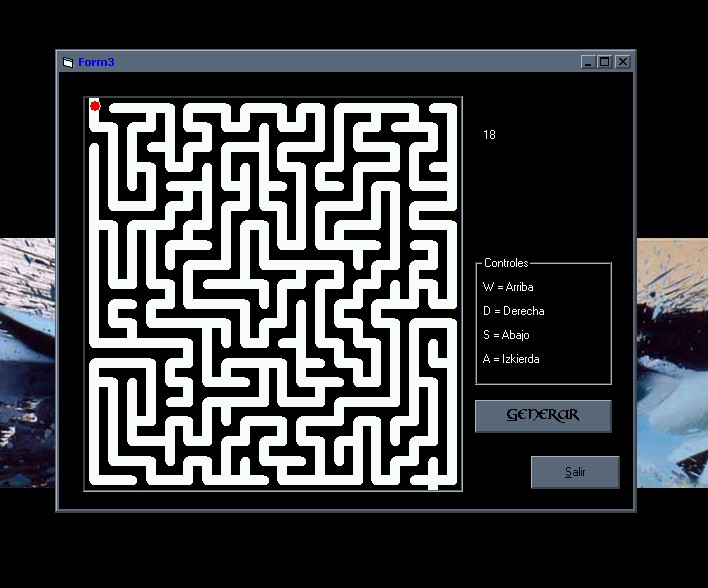



## Maze Creation Using Depth\-First Search

### Description

Maze Creation Using Depth-First Search Algoritm
 
### More Info
 
This code us based in the Depth-First Search Algoritm,this code don't use difficult functions of VB but involves knowledge about logic mathematics the code isn´t optimised as well as I'll want because I had shor time for this code, maybe later I'll optimeze it

And my english isn't very good =)

             |
---                |---
**Submitted On**   |2002-09-13 00:58:18
**By**             |[Javier Loaiza ](https://github.com/Planet-Source-Code/PSCIndex/blob/master/ByAuthor/javier-loaiza.md)
**Level**          |Intermediate
**User Rating**    |4.0 (16 globes from 4 users)
**Compatibility**  |VB 6\.0
**Category**       |[Coding Standards](https://github.com/Planet-Source-Code/PSCIndex/blob/master/ByCategory/coding-standards__1-43.md)
**World**          |[Visual Basic](https://github.com/Planet-Source-Code/PSCIndex/blob/master/ByWorld/visual-basic.md)
**Archive File**   |[Maze\_Creat1304909132002\.zip](https://github.com/Planet-Source-Code/javier-loaiza-maze-creation-using-depth-first-search__1-38948/archive/master.zip)

